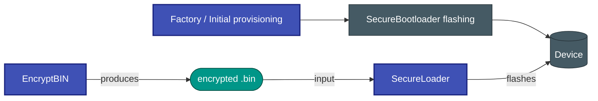

# Secure Bootloader

A **platform-independent secure bootloader** for embedded systems that delivers AES-CBC-encrypted, CRC-32-verified firmware over UART.


## Tool Ecosystem

This bootloader is one part of a three-tool firmware-update chain:

| Tool | Role |
|---|---|
| 🔐 **[EncryptBIN](https://github.com/niwciu/EncryptBIN)** | Generates the AES-128-CBC encrypted firmware package on the PC |
| 📡 **[SecureLoader](https://github.com/niwciu/SecureLoader)** | Transfers the encrypted package to the device over serial (CLI + GUI) |
| 🛡️ **SECURE_BOOTLOADER** *(this project)* | Bootloader on the MCU — decrypts, verifies, and flashes the firmware |



## Tool Compatibility

**EncryptBIN** v0.1.0 is compatible with all SecureLoader and SecureBootloader versions.

The SecureBootloader ↔ SecureLoader pairing is version-locked because a protocol change in v2.0.0 reduced `header_t` from 48 → 44 bytes:

| SecureBootloader | Compatible SecureLoader |
|---|---|
| v1.x.x (v1.0.0) | v1.x.x (v1.0.0, v1.1.0, v1.2.0) |
| v2.x.x (v2.0.0) | v2.x.x (v2.0.0) |

See [Wire Protocol](docs/architecture/protocol.md) for the header layout change details.

## Features

- AES-128-CBC encrypted firmware transport with per-image IV
- CRC-32/IEEE 802.3 integrity verification over the full plaintext image
- Atomic flash write — application reset vector committed only after CRC passes
- 64-bit device ID check rejects firmware built for a different device
- Push-button stay-alive extension without host intervention
- Selectable software or hardware CRC (STM32 CRC peripheral)
- 44 unit tests (Unity + CMock) — no hardware required

## Supported Target Implementations

| Target | MCU | Core | Flash |
|--------|-----|------|-------|
| STM32G070RB | STM32G070RBTx | Cortex-M0+ | 128 KB |
| STM32G071RB | STM32G071RBTx | Cortex-M0+ | 128 KB |
| STM32G474RE | STM32G474RETx | Cortex-M4F | 512 KB |
| ATmega328P | ATmega328P | AVR8 | 32 KB |

> For unsupported targets, integration requires implementing a hardware abstraction (driver) layer based on the provided repository template.

## Quick Start

```bash
# Configure for STM32G070RB — CMake auto-detects STM32CubeProgrammer and creates flash/erase/reset targets
cd hw/STM32G070RB
cmake -S . -B Debug -G Ninja -DBUILD_TYPE=Debug

# Build
ninja -C Debug

# Flash / Erase / Reset — all predefined, no extra commands needed
ninja -C Debug flash
ninja -C Debug erase
ninja -C Debug reset

# Run unit tests with coverage (host, no hardware needed)
cd test/MAIN_APP
cmake -S . -B Debug -G Ninja && ninja -C Debug ccc
```

Supply your AES key and device ID for production:

```bash
cmake -S . -B Release -G Ninja \
    -DBUILD_TYPE=Release \
    -DDEVICE_ID=0x00A0000BC22510E1 \
    -DENCR_KEY="{0x21,0xBB,0xA1,0x8D,0xF4,0x9B,0x1E,0x77,0x26,0x6F,0x80,0x92,0x4C,0x35,0xE6,0xB8}"
```

Update firmware (after the bootloader is running on the device):

```bash
# 1 — Encrypt your application binary
encrypt-bin -i app.bin -o encrypted.bin -d 0x00A0000BC22510E1 \
    -k "21 BB A1 8D F4 9B 1E 77 26 6F 80 92 4C 35 E6 B8" \
    -b 0x00000001 -v 0x20260301 -p 0x20260201

# 2 — Upload to the device
sld flash --file encrypted.bin --port /dev/ttyUSB0 --baudrate 115200
```

## Documentation

Full documentation is available at the project site, built with MkDocs Material.

```bash
pip install mkdocs-material
mkdocs serve       # local preview at http://localhost:8000
mkdocs build       # static site in site/
```

## Development Environment

A Dev Container configuration is included (`.devcontainer/`). Open the repository in VS Code and accept the prompt to reopen in the container — all toolchains are pre-installed.

Alternatively, install the required tools manually:

```bash
# ARM cross-compiler
sudo apt install gcc-arm-none-eabi binutils-arm-none-eabi

# AVR cross-compiler
sudo apt install gcc-avr avr-libc avrdude

# Build tools
sudo apt install cmake ninja-build

# STM32 flashing — STM32CubeProgrammer (auto-detected by CMake) from st.com
# or open-source alternative:
sudo apt install stlink-tools

# Code quality
sudo apt install cppcheck clang-format
pip install lizard

# Firmware update tools
git clone https://github.com/niwciu/EncryptBIN.git && pip install -e EncryptBIN/.
git clone https://github.com/niwciu/SecureLoader.git && pip install -e SecureLoader/.
```

## Repository Structure

```
src/           Platform-independent bootloader core
lib/           Third-party libraries (tiny-AES-c)
hw/            Hardware targets (one subdirectory per MCU)
test/          Unit tests (Unity + CMock)
docs/          MkDocs documentation source
```

## License
MIT License
Copyright © 2026 niwciu

<div align="center">

***


***
</div>