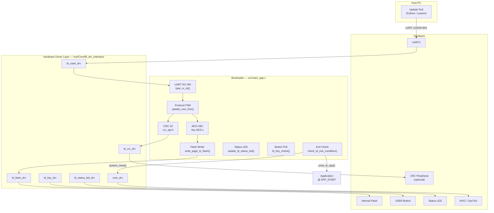
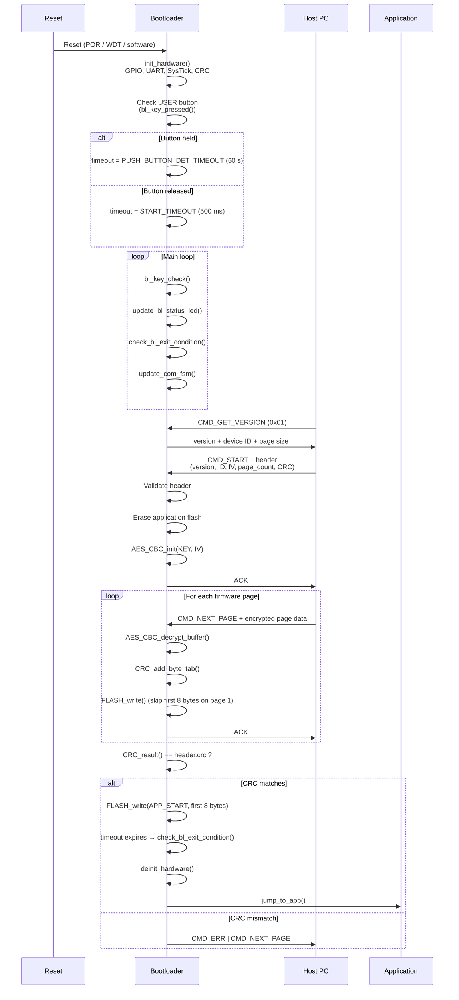

# System Overview

## Block Diagram



---

## Module Responsibilities

### `src/main_app.c` — Bootloader Core

The only platform-independent source file. Contains:

| Function | Role |
|----------|------|
| `main_app()` | Entry point; initialises hardware, runs main loop |
| `byte_rx_cb()` | UART ISR callback; feeds bytes into the protocol FSM |
| `handle_new_cmd()` | Arms the receive buffer for multi-byte commands |
| `update_com_fsm()` | Dispatches fully received commands |
| `do_get_version()` | Replies with protocol version, device ID, flash page size |
| `do_start()` | Validates firmware header; erases app flash; initialises AES and CRC |
| `do_next_page()` | Decrypts one page; accumulates CRC; writes to flash |
| `write_page_to_flash()` | Issues the actual flash write; defers the first 8 bytes |
| `check_bl_exit_condition()` | Jumps to app or resets when the timeout expires |
| `update_bl_status_led()` | Toggles the status LED every 500 ms |
| `bl_key_check()` | Debounces the push-button; extends stay-alive timeout |
| `update_SysTick_tim()` | SysTick ISR callback; increments the 100 ms tick counter |

### `hw/<TARGET>/Core/Bl_drv_interface/` — Hardware Drivers

Six driver modules, each implementing a fixed interface. The core never accesses registers directly.

| Driver | Header | Responsibility |
|--------|--------|----------------|
| `bl_usart_drv` | `bl_usart_drv.h` | UART init/deinit, byte TX, RX ISR, callback registration |
| `bl_flash_drv` | `bl_flash_drv.h` | Flash unlock/lock, page erase, double-word write |
| `bl_key_drv` | `bl_key_drv.h` | GPIO input for push-button (active-low polling) |
| `bl_status_led_drv` | `bl_status_led_drv.h` | GPIO output for status LED |
| `bl_crc_drv` | `bl_crc_drv.h` | Hardware CRC peripheral (only compiled when `CRC_MODULE=HW`) |
| `core_drv` | `core_drv.h` | SysTick, NVIC, MSP setup, app jump, system reset, app validity |

### `src/CRC/crc.c` — Software CRC

Bit-by-bit software implementation of CRC-32/IEEE 802.3 (poly `0x04C11DB7`, refin/refout, xorout `0xFFFFFFFF`). Selected when `CRC_MODULE=SW` (the default).

### `lib/tiny-AES-c/` — AES Encryption

Third-party AES-128-CBC implementation by kokke. Used for decrypting the incoming firmware stream. The AES key is injected at compile time via the `ENCR_KEY` CMake option.

---

## Boot Flow



---

## Memory Map (STM32G070RB example)

```
0x08000000 ┌──────────────────────────┐
           │  Bootloader (4 KB)       │  FLASH (rx) in linker.ld
           │  ISR vectors + code      │
0x08001000 ├──────────────────────────┤  ← APP_START
           │  Application (≤124 KB)   │  Written by do_next_page()
           │                          │
           │  First 8 bytes written   │  ← deferred until CRC passes
           │  last (atomic guarantee) │
0x08020000 └──────────────────────────┘  ← APP_END
           
0x20000000 ┌──────────────────────────┐
           │  SRAM (36 KB)            │
           │  Stack, page_buf,        │
           │  volatile state          │
0x20009000 └──────────────────────────┘
```

!!! note "Page buffer alignment"
    `page_buf` is declared with `__attribute__((aligned(4)))` so the `uint32_t *` cast used during flash writes is always correctly aligned on Cortex-M0+ targets, which do not support unaligned word accesses.
