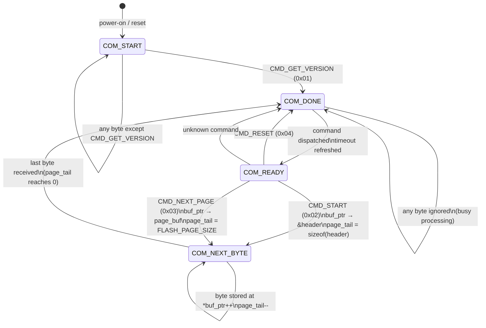

# Wire Protocol

The bootloader uses a compact binary protocol over UART (115200 baud, 8N1, no flow control).

---

## Command Bytes

| Name | Value | Direction | Payload |
|------|-------|-----------|---------|
| `CMD_GET_VERSION` | `0x01` | Host → BL | none |
| `CMD_START` | `0x02` | Host → BL | `sizeof(header_t)` bytes |
| `CMD_NEXT_PAGE` | `0x03` | Host → BL | `FLASH_PAGE_SIZE` bytes |
| `CMD_RESET` | `0x04` | Host → BL | none |
| `CMD_OK` | `0x40` | BL → Host | ORed with the command byte |
| `CMD_ERR` | `0x80` | BL → Host | ORed with the command byte |

Response bytes are always a bitwise OR of the status flag with the original command:

```
0x41 = CMD_OK  | CMD_GET_VERSION   (success)
0xC3 = CMD_ERR | CMD_NEXT_PAGE     (CRC mismatch or out-of-range write)
```

---

## Command Descriptions

### CMD_GET_VERSION (`0x01`)

Requests the bootloader identity. Valid only when the FSM is in `COM_START` state (before any upload session).

**Request:** single byte `0x01`

**Response:** 17 bytes

```
Byte 0      : 0x41  (CMD_OK | CMD_GET_VERSION)
Bytes 1–4   : protocol_version  (uint32_t, little-endian) = 0x00000001
Bytes 5–12  : device_id         (uint64_t, little-endian)
Bytes 13–16 : flash_page_size   (uint32_t, little-endian) = 2048
```

---

### CMD_START (`0x02`)

Opens an upload session. The host sends this command followed immediately by the firmware header. The bootloader validates the header, erases the application flash region, and initialises AES and CRC state.

**Request:** `0x02` + `sizeof(header_t)` bytes

```c
typedef struct {
    uint32_t protocol_version;  // Must match PROTOCOL_VERSION
    uint32_t product_ID_MSB;    // Upper 32 bits of DEVICE_ID
    uint32_t product_ID_LSB;    // Lower 32 bits of DEVICE_ID
    uint32_t app_version;       // Informational; not validated
    uint32_t page_count;        // 1 … (APP_LAST_PAGE - APP_START_PAGE + 1)
    uint32_t flash_page_size;   // Must match FLASH_PAGE_SIZE
    uint8_t  iv[16];            // AES-CBC initialisation vector
    uint32_t crc;               // Expected CRC-32 of the plaintext image
} header_t;                     // total: 44 bytes
```

**Validation rules** (any failure → `CMD_ERR | CMD_START`):

- `protocol_version == PROTOCOL_VERSION`
- `(product_ID_MSB << 32) | product_ID_LSB == DEVICE_ID`
- `flash_page_size == FLASH_PAGE_SIZE`
- `page_count >= 1`
- `page_count <= (APP_LAST_PAGE - APP_START_PAGE + 1)`

**Response on success:** `0x42` (`CMD_OK | CMD_START`)

On success the bootloader:

1. Unlocks flash
2. Erases every page from `APP_START_PAGE` through `APP_LAST_PAGE`
3. Locks flash
4. Calls `AES_CBC_init(KEY, header.iv)`
5. Calls `CRC_init()` and stores the running CRC
6. Resets `page_pos = APP_START`, `page_rem = page_count`
7. Transitions to `COM_READY` and refreshes the communication timeout

---

### CMD_NEXT_PAGE (`0x03`)

Delivers one page of encrypted firmware. The host sends this command followed immediately by exactly `FLASH_PAGE_SIZE` (2048) bytes of AES-CBC ciphertext.

**Request:** `0x03` + `FLASH_PAGE_SIZE` encrypted bytes

**Processing:**

1. Decrypt the page in-place: `AES_CBC_decrypt_buffer(page_buf, FLASH_PAGE_SIZE)`
2. Accumulate CRC: `crc = CRC_add_byte_tab(crc, page_buf, FLASH_PAGE_SIZE)`
3. **First page only** — buffer the first 8 bytes (reset vector + initial SP) into `app_begin_word[]`; advance the write pointer past them
4. Write the remaining data to flash at `page_pos`
5. Advance `page_pos += FLASH_PAGE_SIZE`, decrement `page_rem`
6. **Last page** — call `CRC_result(crc)` and compare with `header.crc`:
    - Match → write the deferred 8 bytes to `APP_START`
    - Mismatch → respond `CMD_ERR | CMD_NEXT_PAGE`

**Response on success:** `0x43` (`CMD_OK | CMD_NEXT_PAGE`)

**Pre-condition errors** (→ `CMD_ERR | CMD_NEXT_PAGE`):

- `page_pos < APP_START` or `page_pos >= APP_END`
- `page_rem == 0`

---

### CMD_RESET (`0x04`)

Forces an immediate system reset. The bootloader sends `CMD_OK | CMD_RESET` (`0x44`), waits for the byte to be fully transmitted, then calls `system_reset()`.

---

## Protocol State Machine



### State descriptions

| State | Meaning |
|-------|---------|
| `COM_START` | Initial state after reset. Only `CMD_GET_VERSION` is accepted. All other bytes are silently discarded (timeout still counts down). |
| `COM_READY` | Session open; any valid command accepted. Entered after the first successful command dispatch. |
| `COM_NEXT_BYTE` | Receiving multi-byte payload (header or page data). Each UART byte is stored via `buf_ptr` and `page_tail` is decremented. |
| `COM_DONE` | Full frame received; pending dispatch by `update_com_fsm()`. Bytes received in this state are ignored. |

---

## Timeout Behaviour

Three independent timeouts control how long the bootloader stays alive:

| Constant | Default | Condition |
|----------|---------|-----------|
| `START_TIMEOUT` | 5 ticks (500 ms) | Initial window before any command is received |
| `COMM_TIMEOUT` | 10 ticks (1 s) | Added to `_100ms_Tick` after each successful command; resets the deadline |
| `PUSH_BUTTON_TIMEOUT` | 3000 ticks (300 s) | Set when a confirmed button press-release is detected |
| `PUSH_BUTTON_DET_TIMEOUT` | 600 ticks (60 s) | Set at startup when the button is already held |

When `_100ms_Tick >= timeout`:

- If `com_state != COM_NEXT_BYTE` **and** `CORE_is_valid_app()` → `deinit_hardware()` then `jump_to_app()`
- Otherwise → `do_reset()` (sends `CMD_OK | CMD_RESET` then `system_reset()`)

The `COM_NEXT_BYTE` guard prevents a timeout from interrupting a page transfer mid-stream.

---

## Typical Transfer Session

```
Host                          Bootloader
 │                                │
 │──── 0x01 (GET_VERSION) ───────►│
 │◄─── 0x41, ver, id, page_sz ───│
 │                                │
 │──── 0x02 (START) ─────────────►│
 │──── header[0..N] ─────────────►│  N = sizeof(header_t)
 │◄─── 0x42 (OK|START) ──────────│
 │                                │
 │──── 0x03 (NEXT_PAGE) ─────────►│
 │──── page_data[0..2047] ───────►│  2048 bytes AES-CBC ciphertext
 │◄─── 0x43 (OK|NEXT_PAGE) ──────│
 │         ⋮ (repeat for each page)
 │──── 0x03 (NEXT_PAGE) ─────────►│  last page
 │──── page_data[0..2047] ───────►│
 │◄─── 0x43 (OK|NEXT_PAGE) ──────│  only if CRC matches
 │                                │
 │         (bootloader times out and jumps to app)
```
