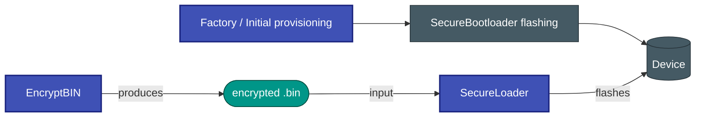

# Secure Bootloader

A **platform-independent secure bootloader** for embedded systems that delivers AES-CBC-encrypted, CRC-32-verified firmware over UART — without a full OTA stack.


---

## Tool Ecosystem

This bootloader is one part of a three-tool firmware-update chain:

| Tool | Role |
|---|---|
| 🔐 **[EncryptBIN](https://github.com/niwciu/EncryptBIN)** | Generates the AES-128-CBC encrypted firmware package on the PC |
| 📡 **[SecureLoader](https://github.com/niwciu/SecureLoader)** | Transfers the encrypted package to the device over serial (CLI + GUI) |
| 🛡️ **SECURE_BOOTLOADER** *(this project)* | Bootloader on the device — decrypts, verifies, and flashes the firmware |



---

## Features

- **Encrypted transport** — AES-128-CBC with a per-image IV embedded in the firmware header
- **Integrity verification** — CRC-32/IEEE 802.3 computed across the complete firmware image
- **Atomic flash write** — the application reset vector is written last, only after the full-image CRC passes; a partial transfer can never boot
- **Push-button stay-alive** — a physical button extends the bootloader window without host involvement
- **Configurable timeouts** — independent start, communication, and button-hold timeouts
- **Hardware CRC option** — switchable between a software CRC implementation and the STM32 CRC peripheral at CMake configuration time
- **Portable architecture** — all hardware access is behind a thin driver interface; porting to a new MCU requires only that interface
- **Full unit-test coverage** — 44 tests (Unity + CMock) exercise every protocol state and edge case without hardware

---

## Supported Targets

| Target | MCU | Core | Flash | SRAM | Notes |
|--------|-----|------|-------|------|-------|
| STM32G070RB | STM32G070RBTx | Cortex-M0+ | 128 KB | 36 KB | NUCLEO-G070RB |
| STM32G071RB | STM32G071RBTx | Cortex-M0+ | 128 KB | 36 KB | NUCLEO-G071RB |
| STM32G474RE | STM32G474RETx | Cortex-M4F | 512 KB | 128 KB | NUCLEO-G474RE |
| ATMEGA328P | ATmega328P | AVR8 | 32 KB | 2 KB | Arduino Uno R3 |
| STM32_TEMPLATE | any STM32 | any | — | — | Porting starting point |

The bootloader itself occupies the first **4 KB** of flash on all STM32 targets. The application region begins immediately after.

---

## Quick Navigation

<div class="grid cards" markdown>

- :material-rocket-launch: **[Getting Started](getting-started.md)**  
  Build, flash and run in under ten minutes.

- :material-sitemap: **[Architecture](architecture/overview.md)**  
  Block diagrams, boot flow and component responsibilities.

- :material-protocol: **[Wire Protocol](architecture/protocol.md)**  
  Command reference, packet format and state machine.

- :material-shield-lock: **[Security Model](architecture/security.md)**  
  AES-CBC, CRC-32 and the atomic flash-write guarantee.

- :material-chip: **[Porting Guide](porting/index.md)**  
  Add a new MCU target in six steps.

- :material-hammer-wrench: **[Build System](build/cmake.md)**  
  CMake options, key injection, device ID.

- :material-test-tube: **[Testing](testing/unit-tests.md)**  
  Unit test suite, coverage, and how to run it.

- :material-lock-outline: **[EncryptBIN](https://github.com/niwciu/EncryptBIN)**  
  Produce the encrypted `.bin` package from your application binary.

- :material-upload: **[SecureLoader](https://github.com/niwciu/SecureLoader)**  
  Upload the encrypted package to the target over serial.

</div>

---

## Repository Layout

```
SECURE_BOOTLOADER/
├── src/                    # Platform-independent bootloader core
│   ├── main_app.c          #   Main loop, protocol FSM, flash write logic
│   ├── main_app.h          #   Public API (single entry point)
│   ├── main_app_priv.h     #   Internal protocol types (tests & core only)
│   └── CRC/
│       ├── crc_api.h       #   CRC-32 interface (SW and HW share this)
│       └── crc.c           #   Software CRC-32/IEEE 802.3 implementation
├── lib/
│   └── tiny-AES-c/         # AES-128-CBC library (third-party)
├── hw/
│   ├── STM32G070RB/        # STM32G070RB target
│   ├── STM32G071RB/        # STM32G071RB target
│   ├── STM32G474RE/        # STM32G474RE target
│   ├── ATMEGA328P_ARDUINO_UNO_R3/  # ATmega328P target
│   ├── STM32_TEMPLATE/     # Porting template for new STM32 targets
│   ├── cmake/              # Shared CMake utilities (key parsing)
│   └── config/             # Toolchain files (ARM GCC, AVR GCC)
├── test/
│   ├── MAIN_APP/           # Unit tests for the bootloader core
│   ├── CRC/                # Unit tests for the CRC module
│   ├── unity/              # Unity test framework
│   ├── cmock/              # CMock framework
│   └── __embedded_target_manager/  # Python test orchestration
└── docs/                   # This documentation
```
